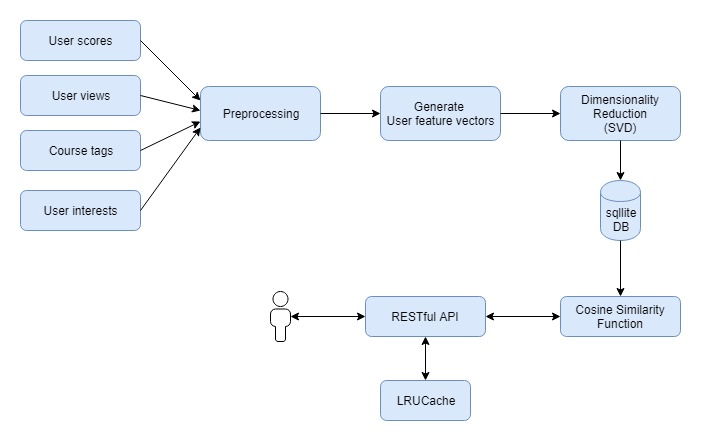

# user_similarity

This project is to find similar users using the courses data.
This contais data preprocessing steps and the API code for RESTful endpoint

### Dependencies

- Python (>= 2.7 or >= 3.4)
- NumPy (>= 1.8.2)
- SciPy (>= 0.13.3)

### Source code

git clone https://github.com/jinilcs/user_similarity.git

### Data Flow Diagram:

### RESTful API Endpoint:

http://ec2-54-197-13-230.compute-1.amazonaws.com/similarusers/156 => Returns 10 similar users of user handle 156

http://ec2-54-197-13-230.compute-1.amazonaws.com/similarusers/156?numusers=200 => Returns 156 similar users of user handle 156

### Other Notes:

Similarity calculation:
I have used cosine similarity to find the similar users. The data set I used here will become a huge sparse matrix after preprocessing. Cosine similarity works really good on big sparse dataset.

Big data recommendations:
Here I used pandas to preprocess the data. For huge data set, we should consider distributed file systems like HDFS for storage and SparkSQL dataframes to preprocess the data. 
I have used caching on RESTful API, so frequent requests will be faster.

Other data to collect:
As this is to find similar users, we will be able to create better models if we have user's personal details (age, sex, location, occupation etc). Ratings given by user to each course will be a very good data for this model. Or if we have user comments on courses, we could do sentiment analysis using NLP as well
